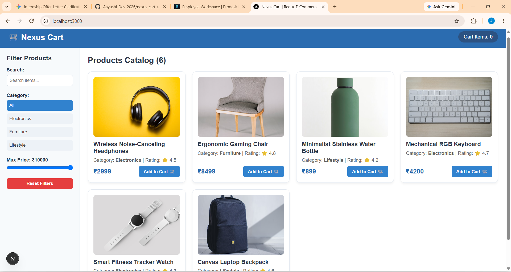
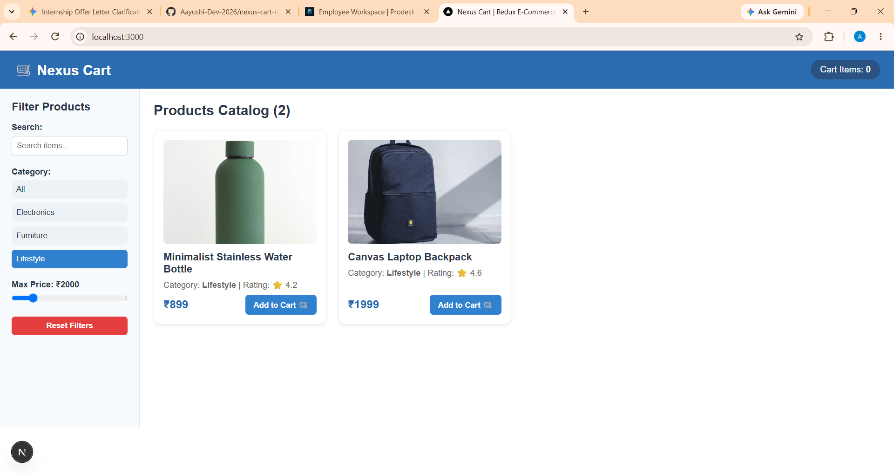
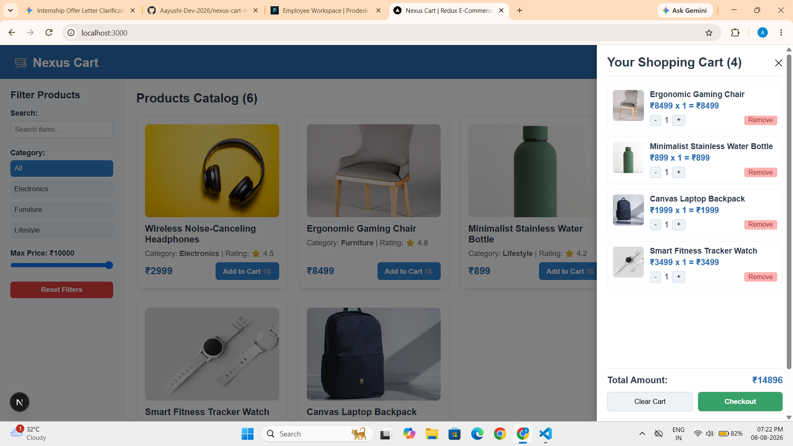
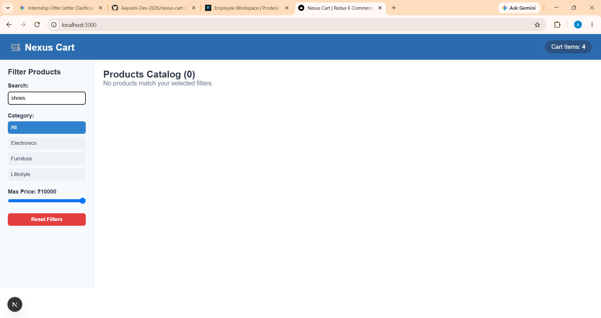

# 🛒 Nexus Cart — State Management SPA (Redux Toolkit)

Welcome to **Nexus Cart**, a high-performance Single Page Application (SPA) built with **Next.js 15 App Router** and **Redux Toolkit (RTK)**. 

This project is built under **Track A: State Management Application**, focusing on centralized immutable state architecture, dynamic catalog filtering, real-time total calculations, and an interactive slide-over cart drawer.

---

## 🌟 Key Features

* **Centralized State Management**: Powered by `@reduxjs/toolkit` and `react-redux` for structured global state across the app.

* **Dynamic Product Catalog**: Displays mock e-commerce items with ratings, prices, and categories.

* **Multi-Criteria Filtering**: Filter products dynamically by **Search Query**, **Category**, and **Max Price Range** in real-time.

* **Interactive Shopping Cart Drawer**: Slide-over modal interface to manage items (`Add`, `Remove`, `Increment`, `Decrement`, `Clear Cart`).

* **Instant State Synchronicity**: Cart badge counter and pricing totals update instantaneously across all UI components.

* **Responsive & Clean UI**: Styled with modern CSS-in-JS utility patterns for seamless cross-device layout.

---

## 🛠️ Tech Stack & Architecture

| Layer | Technology |
| :--- | :--- |
| **Framework** | Next.js 15 (App Router) |
| **State Management** | Redux Toolkit (`@reduxjs/toolkit`, `react-redux`) |
| **Language** | JavaScript (ES6+) / React 19 |
| **Styling** | Modular Inline Style Objects / CSS3 |
| **Version Control** | Git & GitHub |

---

## 📂 Directory Structure

```text
nexus-cart-redux/
├── src/
│   ├── app/
│   │   ├── layout.js          # Root layout wrapped with ReduxProvider
│   │   ├── page.js            # Main home catalog page & layout orchestration
│   │   └── globals.css        # Global CSS styling baseline
│   ├── components/
│   │   ├── ProductCard.js     # Individual product UI & Add-to-Cart trigger
│   │   ├── FilterSidebar.js   # Real-time search, category & price filters
│   │   └── CartDrawer.js      # Slide-over cart modal & quantity controls
│   ├── data/
│   │   └── products.js        # Mock e-commerce product dataset
│   ├── providers/
│   │   └── ReduxProvider.js   # Client component wrapper for Redux Store
│   └── redux/
│       ├── store.js           # Centralized RTK Store configuration
│       └── slices/
│           ├── cartSlice.js   # State & reducers for Shopping Cart
│           └── filterSlice.js # State & reducers for Dynamic Filtering
├── public/                    # Static UI assets & media
├── package.json               # Dependencies & project metadata
└── README.md                  # Project documentation
```

---

## 🚀 Getting Started :
**Follow these steps to run the application locally on your machine:**

### 1. Clone the Repository

```bash
git clone [https://github.com/Aayushi-Dev-2026/nexus-cart-redux.git](https://github.com/Aayushi-Dev-2026/nexus-cart-redux.git)
cd nexus-cart-redux
```

---

### 2. Install Dependencies

```bash
npm install
```

---

### 3. Run Development Server

```bash
npm run dev
```

**Open http://localhost:3000 in your browser to view the application live!**

---

## 💡 Redux Architecture Highlights

* **cartSlice:** Tracks items[], totalQuantity, totalAmount, and isCartOpen. Handles atomic actions like addToCart, decreaseQuantity, removeFromCart, clearCart, and toggleCart.

* **filterSlice:** Tracks selectedCategory, maxPrice, and searchQuery. Contains reducers to reset and dynamically calculate visible products.

* **ReduxProvider:** Bypasses Server-Component limitations in Next.js App Router by establishing a clean Client-Side Context boundary.

---

## 📸 Application Screenshots

### 1. Product Catalog & Grid Layout


---

### 2. Interactive Real-Time Filtering


---

### 3. Shopping Cart Drawer & State Management


---

### 4. Empty Filter State & Fallback UI


---

## 🔗 Live Demo
**View the site live here:** [Insert your Vercel or Netlify link here]

---